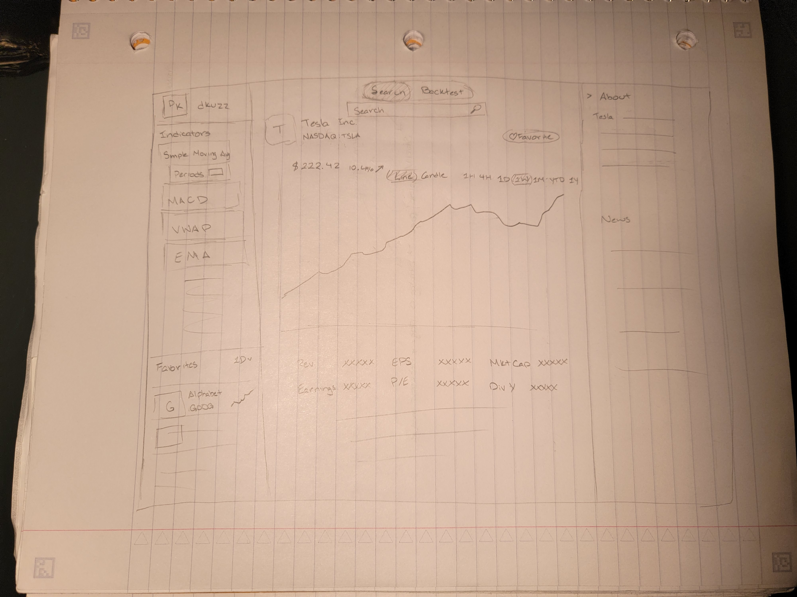
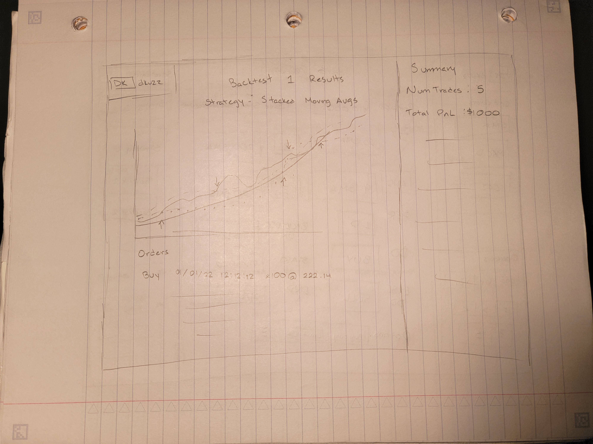
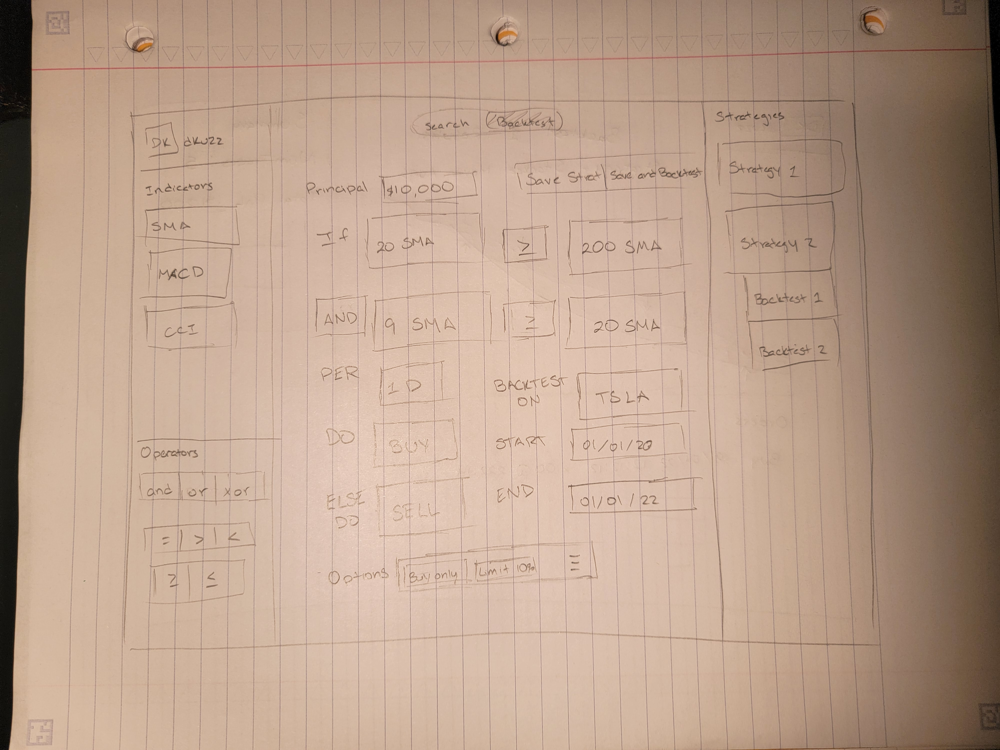
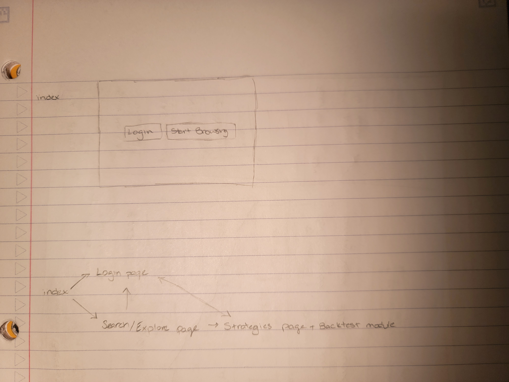

# Stratus

## Overview

Securities nowadays are becoming more unpredictable with times of heightened volatility. To combat this, many have resorted to algorithmic trading. However, these methods may not be known or available to your average retail investor. Stratus aims to show users the possibilities of how simple technical indicators can enhance the investing experience.

Particularly, users can search for their preferred security and then experiment with various indicators. In addition, they can also add signals to their combination of indicators. With this combination, users can lastly backtest these signals to see if they've developed a profitable trade.

## Data Model

The application will store users, indicator data, and backtest results

- Users can have login info, favorites, custom strategies, and backtest results (by reference)
- Indicators will be fixed and themselves cannot be modified by the user. (Because of this, they might not have an actual need to be stored in a DB and can just be on the client)
- Backtests will include the strategy and its results (whatever that entails is TBD)

Example User:

```javascript
{
  username: "dkuzz",
  hash: // a password hash,
  favorites: // an array of securities
  strategies: // an array of strategies
  backtests: // an array of back test result ids
}
```

Example Indicator:

```javascript
{
  name: "Simple Moving Average",
  description: "Plots the average of the previous X periods",
  calculation: // formula
}
```

Example Backtest:

```javascript
{
  name: // name
  description: // what does it do
  strategy: // strategy under which it was run
  results: { startTime: endTime: totalPnL: security: ... }
}
```

## [Link to Commented First Draft Schema](db.mjs)

## Wireframes

Search stocks


Show results of backtests


Shows the place where you can create backtests


Landing page


## Site map


## User Stories or Use Cases

1. as non-registered user, I can register a new account with the site
2. as non-registered user, I can view securities data
3. as non-registered user, I can view indicators data
4. as a user, I can log in to the site
5. as a user, I can create a new strategy
6. as a user, I can execute a backtest
7. as a user, I can review my previous backtests

## Research Topics

- (3 points) Unit testing with JavaScript - Jest
- (3 points) Configuration management - dotenv
- (2 points) Use a CSS framework or UI toolkit - Material UI and Plotly but I'm not sure if I really like the way their components looks
- (6 points) Use a front-end framework - Either React or Next not sure yet
- (6 points) JavaScript library or module - Data processing and analytics - Something like [danfo.js](https://www.npmjs.com/package/danfojs) or [data-forge](https://www.npmjs.com/package/data-forge)
- (4 points) JavaScript library or module - Drag and Drop (not sure if I will be using this yet) - [React DnD](https://www.npmjs.com/package/react-dnd)
- (3 point) JavaScript library or module - API - Maybe [AlphaVantage](https://www.alphavantage.co/) or something else for finance data. I didn't realize but this one apparently has indicators already computed which makes things perhaps a bit easier.
- (1 point) JavaScript library or module - Prebuilt utilities - lodash

Wasn't really sure how many points you want us to allocate for ourselves. 8 or 10 or 18.

## [Link to Initial Main Project File](app.mjs)

https://dribbble.com/shots/18746228-Stock-Market-Dashboard

## Annotations / References Used

### Milestone 2 Update
